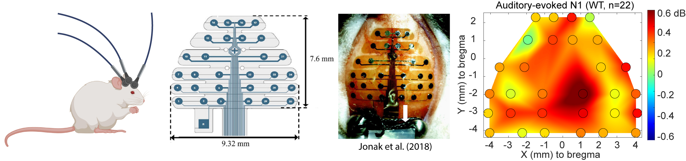

mouseMEA
===========
This is a Matlab code for rendering multielectrode array (MEA) using NeuroNexus H32 Mouse EEG. Electrode sizes and locations are to scale. The syntax is similar to EEGLAB's topoplot, except that the third input, minmax, is mandatory (if you want to use autoscale, you must enter []). Note the channel order is set to that of CCHMC's recording environment.

Reference
===========
- NeuroNexus Technologies. Inc. H32 Mouse EEG Package. Updated May 25, 2017. (technical note)
- Jonak CR, Lovelace JW, Ethell IM, Razak KA, Binder DK. (2018). Reusable multielectrode array technique for electroencephalography in awake freely moving mice. Front Integr Neurosci. 12:53. DOI: 10.3389/fnint.2018.00053, PMID: 30416434, PMCID: PMC6213968.
